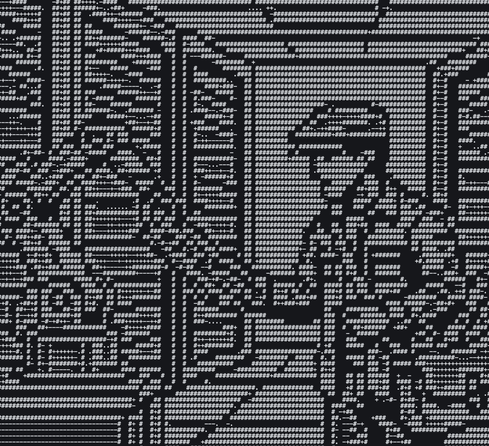

<div align="center">



# GSearch - Free Google Search MCP

[](https://go.dev)
[](LICENSE)
[](https://modelcontextprotocol.io)

Give Claude Code, Codex CLI, Cursor, and other AI tools real-time web search powered by Google Search grounding. Single binary, zero runtime dependencies. **Free with any Google account.**

> **Disclaimer:** Unofficial tool, not affiliated with Google. Uses the same public OAuth client and API as the [open-source Gemini CLI](https://github.com/google-gemini/gemini-cli). Use at your own risk.

</div>

---

## Install

```bash
curl -fsSL https://raw.githubusercontent.com/daanielcruz/gsearch-mcp/main/install.sh | bash
```

Or build from source:

```bash
git clone https://github.com/daanielcruz/gsearch-mcp && cd gsearch-mcp
make build && ./gsearch-installer
```

The installer downloads the binary, configures Claude Code, Codex and Cursor automatically (if available).

## How It Works

```
Claude Code / Codex CLI / Cursor / Others...
        | MCP (stdio)
   gsearch-server (Go binary)
        | OAuth2
   Google Code Assist API
        | googleSearch grounding
   Answer with [1][2][3] source links
```

When an AI tool calls `google_search`, GSearch returns a grounded answer with inline citations:

```
The current time in Sao Paulo is 08:13 AM.[1][2]
Sao Paulo observes Brasilia Time (BRT), UTC-3.[3]

Sources:
[1] Time in Sao Paulo (https://...)
[2] World Clock (https://...)
[3] Time Zone Info (https://...)
```

## Pricing & Limits

GSearch uses the same Google Search grounding API as [Gemini CLI](https://github.com/google-gemini/gemini-cli). **Free with any Google account.** No API key, no credit card, no billing setup.

Rate limits are generous for normal usage. The server retries automatically with dynamic backoff on rapid bursts.

## Authentication

First run requires a Google sign-in. Two options:

1. **Gemini CLI** (if installed) -GSearch reuses existing credentials from `~/.gemini/oauth_creds.json`
2. **Interactive installer** -`./gsearch-installer` opens your browser for Google OAuth

New accounts are auto-provisioned via the Google Code Assist API (SMS verification may be required on first use).

## Configuration

The installer configures everything automatically. For manual setup, add to your MCP client config:

```json
{
  "mcpServers": {
    "gsearch": {
      "command": "npx",
      "args": ["-y", "@daanielcruz/gsearch-mcp"]
    }
  }
}
```

Works with Claude Code (`~/.claude.json`), Cursor (`~/.cursor/mcp.json`), and any MCP-compatible tool.

For Codex CLI (`~/.codex/config.toml`):

```toml
[mcp_servers.gsearch]
command = 'npx'
args = ['-y', '@daanielcruz/gsearch-mcp']
```

Set `GSEARCH_PROJECT` env var only if auto-detection fails.

## License

MIT
